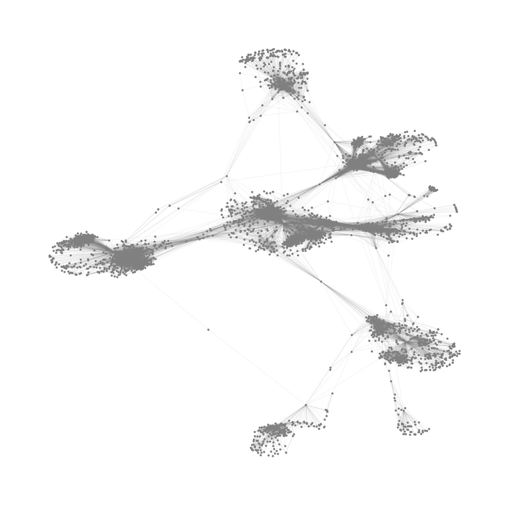
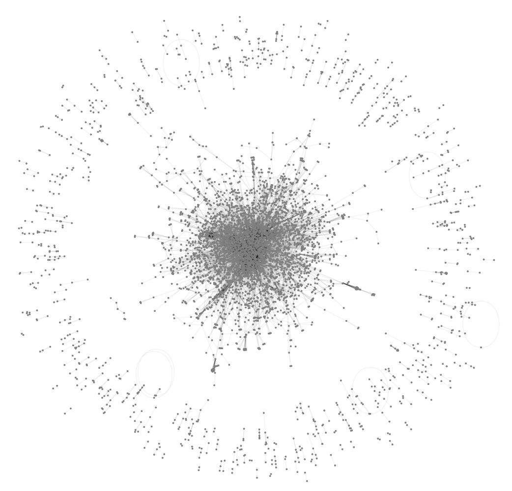

# Influence Maximization on Real-World Networks

This repository contains the full code, data, and experiment results for our influence maximization study across different real-world social networks. Current focus includes the Facebook ego-network dataset and GrQc collaboration network.

## 📊 Dataset Overview

### 1️⃣ Facebook Ego-Network

* The Facebook dataset contains both full network data and detailed ego-centric subgraphs with rich node features.
* Provides a suitable testbed for both **feature-based** and **circle-based** influence maximization algorithms.

#### Dataset files:

| File                       | Description                                                  |
| -------------------------- | ------------------------------------------------------------ |
| `facebook_combined.txt`    | Full Facebook network (nodes and edges combined).            |
| `facebook/`                | Ego-networks with `.feat`, `.egofeat`, and `.circles` files. |
| `combined_feat.csv`        | Merged node features for global experiments.                 |
| `ego_circles_expanded.csv` | Expanded ego-circle membership table.                        |
| `diverse_circle_seeds.txt` | Circle-diversified candidate seeds.                          |

### 📷 Network Visualization

Below is a full visualization of the Facebook network:

### :two: GrQc collaboration network

* The GrQc dataset contains the full network data

#### Dataset files:

| File                       | Description                                                  |
| -------------------------- | ------------------------------------------------------------ |
| `ca-GrQc.txt`              | Full GrQc collaboration network (with some explanation).     |
| `ca-GrQc.csv`              | Full GrQc collaboration network (nodes and edges combined).  |

### 📷 Network Visualization

Below is a full visualization of the GrQc collaboration network:

---

## 💡 Algorithms Implemented

* CELF (Cost-Effective Lazy Forward)
* IMM (Influence Maximization via Martingales)
* Feature-based IMM (feature activity integrated)
* Circle-based IMM (ego-circles for diversity-aware seeds)
* Weighted Circle-based IMM
---

## 💻 Code Components

| File                        | Description                                                          |
| --------------------------- | -------------------------------------------------------------------- |
| `IC.ipynb`                  | Simple IC model testing on toy graph for model validation.           |
| `facebook_simulation.ipynb` | Full experiment pipeline, IC model simulation, algorithm comparison. |
| `facebook_CELF.py`          | Dedicated CELF implementation (standalone script).                   |

---

## 📌 Extension Plan

Other networks can be added and tested with minimal code modification, following the same pipeline.
